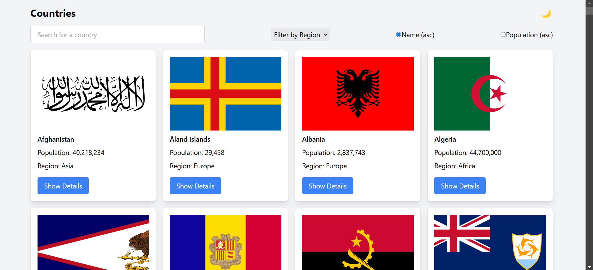
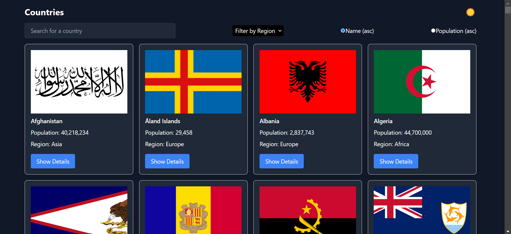

# Country Search App 🌍

A responsive React app to explore country information, featuring dark mode, a search bar, and detailed country views using the REST Countries API.

## Features
- **Home Page**: Displays all countries in responsive cards.
- **Search**: Filter countries by name.
- **Dark Mode**: Toggle between light and dark themes.
- **Country Details**: View extended details about each country on a dedicated page.

## Screenshots
  
*Home Page in Light Mode*

  
*Home Page in Dark Mode*

## Installation

1. Clone the repository:
   ```bash
   git clone https://github.com/kraken300/Countries-API-React.git
   cd Countries-API-React
   ```

2. Install dependencies and start the app:
   ```bash
   npm install
   npm run dev
   ```

3. Open [http://localhost:5173](http://localhost:5173) in your browser.

## Tech Stack
- **Vite** for fast development with **React** & **React Router**
- **Tailwind CSS**
- **REST Countries API**

## Project Structure

```
src/
├── components/
│   ├── CountryCard.jsx       # Card for country summary
│   ├── CountryDetail.jsx     # Detailed country view
│   └── Header.jsx            # Header component with dark mode toggle
├── App.jsx                   # Main app file with routing
└── main.jsx                  # React entry point for Vite

```
